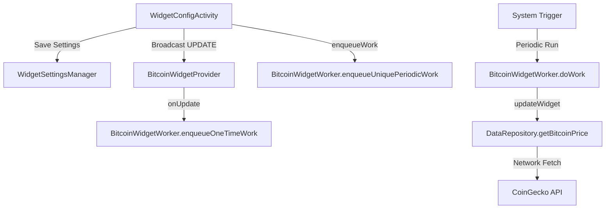

# Bitprix Code Review & Analysis

## 1. Executive Summary
Bitprix is a well-structured Bitcoin tracking application with a clean UI and efficient custom views (like the Fear & Greed gauge). The project follows standard Android patterns for network (Retrofit), data caching (SharedPreferences/Memory), and background work (WorkManager). The separation into `ui`, `data`, `model`, `widget`, and `network` packages provides a good foundation for maintainability.

**Strengths:**
- **Custom View Optimization**: The `FearAndGreedGauge` is excellently optimized, avoiding allocations in `onDraw`.
- **Efficient Caching**: `DataRepository` implements a multi-level cache (Memory + Disk) with proper mutex synchronization.
- **Modern Tech Stack**: Uses Kotlin Coroutines, WorkManager, and Material Design 3.

**Risks:**
- **Widget Update Reliability**: Significant gaps in the background update chain, including missing permissions and triggers for system events like reboots.
- **Concurrency Bottlenecks**: A single global mutex for all data types in `DataRepository` can cause the UI to lag when multiple data types (price, chart, FnG) are fetched simultaneously.
- **UI Logic Coupling**: `MainActivity` is overloaded with business logic that should reside in a ViewModel.

## 2. Critical Issues

| Issue | Severity | Root Cause | Fix | Effort |
| :--- | :--- | :--- | :--- | :--- |
| **Widget Updates fail after reboot** | Critical | No `BOOT_COMPLETED` receiver to reschedule or kickstart WorkManager. | Add `BootReceiver` and appropriate manifest declaration. | 2h |
| **Missing Network Permission** | High | `ACCESS_NETWORK_STATE` is required for WorkManager constraints to work reliably. | Add permission to `AndroidManifest.xml`. | 0.5h |
| **Global Repository Locking** | Medium | `fetchMutex` blocks all data types; fetching a large chart blocks price updates. | Use granular mutexes per data category. | 2h |
| **WorkManager Flex Misconfiguration** | Low | 5m flex on 15m interval is high; can lead to unpredictable update timing. | Reduce flex or remove if not strictly needed for battery. | 1h |

## 3. Improvement Recommendations

| Recommendation | Category | Priority | Rationale | Effort |
| :--- | :--- | :--- | :--- | :--- |
| **MVVM Refactoring** | Architecture | P1 | `MainActivity` handles too much logic; difficult to test and maintain. | 8h |
| **Network Logging** | Code Quality | P2 | No way to inspect API traffic in debug mode. | 1h |
| **Rate Limit Backoff** | Reliability | P1 | CoinGecko has strict limits; WorkManager needs explicit backoff policy. | 2h |
| **Error UI States** | UX | P2 | User doesn't know *why* data isn't updating (e.g. 429 vs No Internet). | 3h |

## 4. Widget Update Deep-Dive

### Current Flow Diagram

### Where it breaks and why:
1. **Device Reboot**: The chain stops at `A/E`. Unless the user opens the app, WorkManager might not resume on some devices without an explicit boot trigger.
2. **Network Constraints**: WorkManager might think there's no network if `ACCESS_NETWORK_STATE` is missing, delaying updates indefinitely.
3. **Overlapping Updates**: Manual refreshes use `setExpedited`, but if many manual refreshes happen, quota is exhausted and fallback logic is needed.

### Specific Changes Needed:
- **`BootReceiver`**: To trigger `enqueueWork()` on boot.
- **`AndroidManifest.xml`**: Add `RECEIVE_BOOT_COMPLETED` and `ACCESS_NETWORK_STATE`.
- **`DataRepository`**: Separate locks for price and chart to avoid the "chart fetch block".

## 5. Sprint Backlog

### Sprint 1: Stability & Reliability (2 weeks)
- **Goal**: Fix all widget update issues and core reliability bugs.
- **Tasks**:
  - Implement `BootReceiver` and permissions (4h)
  - Refactor `DataRepository` locks (4h)
  - Add explicit Retrofit timeouts and logging (2h)
  - Unit tests for `WidgetSettingsManager` (6h)
- **AC**: Widgets update after reboot; manual refreshes don't block each other.

### Sprint 2: Architecture & UX (2 weeks)
- **Goal**: Refactor to MVVM and improve error handling.
- **Tasks**:
  - Implement `MainViewModel` (10h)
  - Add specific error screens/toasts for 429 and connectivity (6h)
  - Clean up `MainActivity` UI code (4h)
- **AC**: Zero business logic in `MainActivity`; clear error messages for users.

## 6. Quick Wins (Impact in < 1 hour)
1. **Add `ACCESS_NETWORK_STATE`**: Instant reliability boost for WorkManager.
2. **Remove `WRITE_EXTERNAL_STORAGE` for API 29+**: Cleaner permission profile.
3. **Add `HttpLoggingInterceptor`**: Massive debugging aid.
4. **Reduce WorkManager Flex Interval**: More predictable updates.
5. **Fix misleading time in `response == null` case**: Shows current time when price is missing; should show "Never" or placeholder.
