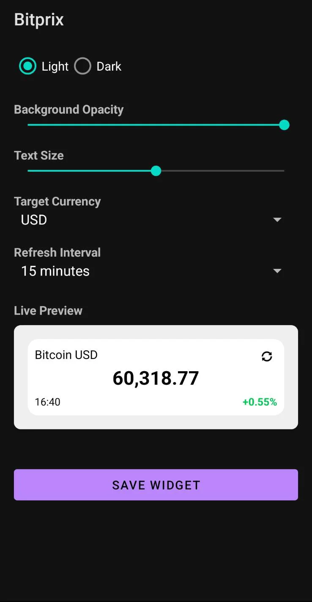
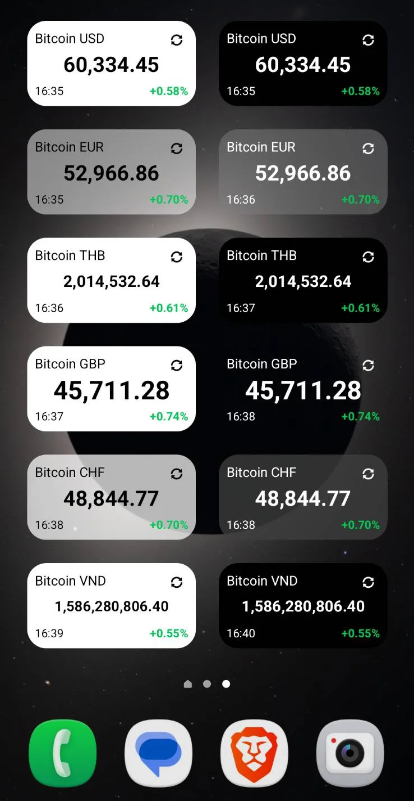
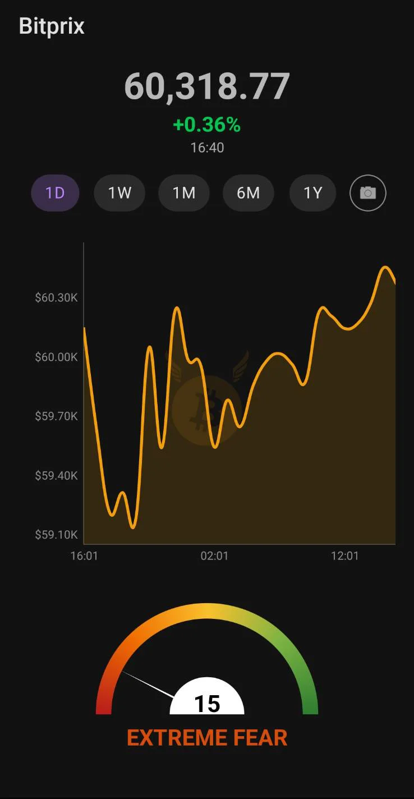

# Bitprix - Bitcoin Price Widget

Bitprix is a modern, lightweight Android application and home screen widget designed to track Bitcoin prices, market trends, and the Fear & Greed index in real-time.

## Features

- **Home Screen Widget**: Stay updated with Bitcoin's price directly from your home screen.
- **Multiple Currencies**: 47 fiat currencies, searchable by code (USD, EUR, GBP, JPY, ...).
- **Timeframe-Aware Change**: The percentage under the price reflects the selected timeframe and is labelled with it (24h / 1W / 1M / 6M / 1Y).
- **Interactive Price Chart**: View price history with multiple timeframes (1D, 1W, 1M, 6M, 1Y).
- **Fear & Greed Index**: Visual gauge to monitor market sentiment.
- **Auto-Refresh**: Background updates via WorkManager to keep data fresh.
- **Manual Refresh**: Force updates directly from the app or widget.
- **Chart Screenshots**: Save and share price charts with a single tap.
- **Material Design**: Clean, modern UI with support for system dark mode.

## Screenshots

| Configuration          | Widgets                         | App                                  |
|------------------------|---------------------------------|--------------------------------------|
|  |  |  |

## Getting Started

### Prerequisites
- Android device running **API 26 (Android 8.0 Oreo) or higher**.
  This matches the app's `minSdk`. Note that some widget-refresh behaviour differs below API 31:
  manual refreshes are expedited only on Android 12+, and fall back to ordinary background work
  on older versions.

### Installation
1. Download [the latest APK](https://github.com/hypnoticHODL/bitprix/releases/latest) and install it on your Android device.
2. Enable "Install from unknown sources" in your settings if required.

or

1. Clone the repository:
   ```bash
   git clone https://github.com/hypnoticHODL/bitprix.git
   ```
2. Open the project in Android Studio.
3. Build and run the app on your device or emulator.

## How to use the Widget
1. Long-press on your home screen.
2. Select **Widgets**.
3. Find **Bitprix** and drag it to your home screen.
4. Select your preferred currency in the configuration screen.

The widget shows the **24-hour** change, which is intentionally different from the app's
timeframe-aware figure. Both are labelled so the difference is visible rather than contradictory.

## Building

```bash
./gradlew assembleDebug        # build
./gradlew testDebugUnitTest    # unit tests
./gradlew lintDebug            # lint
```

### Requirements
- JDK 11+
- Android SDK with API 37 (compile SDK)

## Technologies Used
- **Kotlin**: Primary programming language.
- **Retrofit & OkHttp**: For network requests to CoinGecko and Fear & Greed APIs.
- **WorkManager**: For reliable background data syncing.
- **MPAndroidChart**: For rendering interactive price charts.
- **Coroutines & Lifecycle**: For efficient asynchronous operations.

## Data Sources
- Price and Chart Data: [CoinGecko API](https://www.coingecko.com/en/api)
- Market Sentiment: [Alternative.me Fear and Greed Index](https://alternative.me/crypto/fear-and-greed-index/)

## License

This project is licensed under the MIT License - see the LICENSE file for details.
